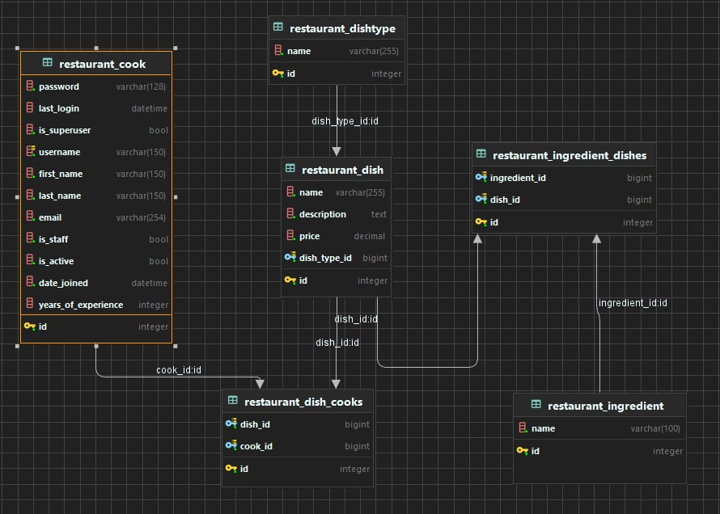
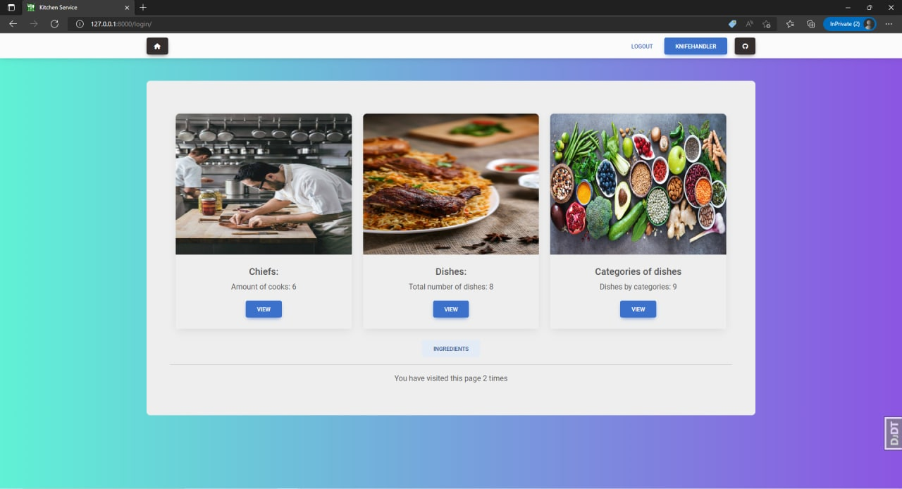
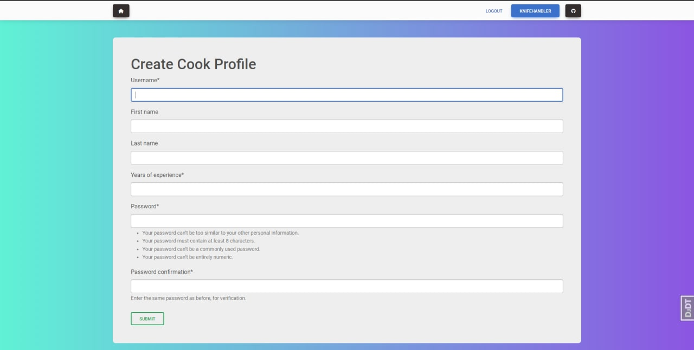
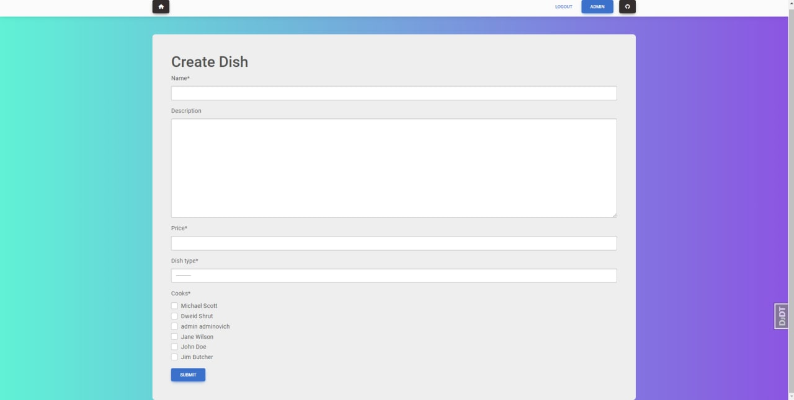

# Restaurant Kitchen Service

Django Project for managing restaurant kitchen. 

## Check it out!

[Kitchen service project]()

## Installation

Python3 must be already installed.

```shell
git clone git clone https://github.com/wQuelS/restaurant-kitchen-service
cd restaurant_kitchen_service
python -m venv venv
venv\Scripts\activate (on Windows)
source venv/bin/activate (on macOS)
pip install -r requirements.txt
python manage.py runserver # starts Django Server
```

## Features


* Authentication functionality for Cook/User
* Managing cooks, dishes, dish types and ingredients.
* Powerful admin panel for advanced managing
* Security for all data


## DB Structure


## Demo pages



